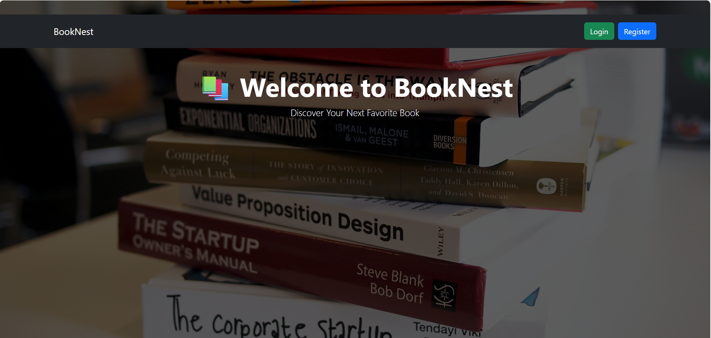
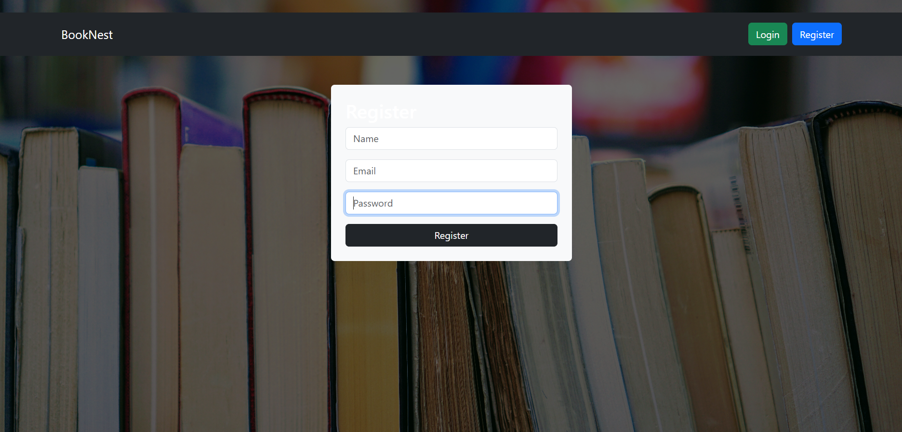
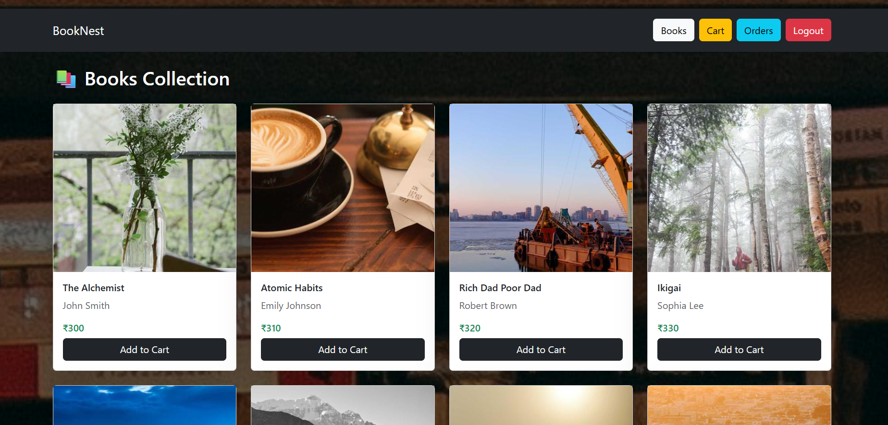
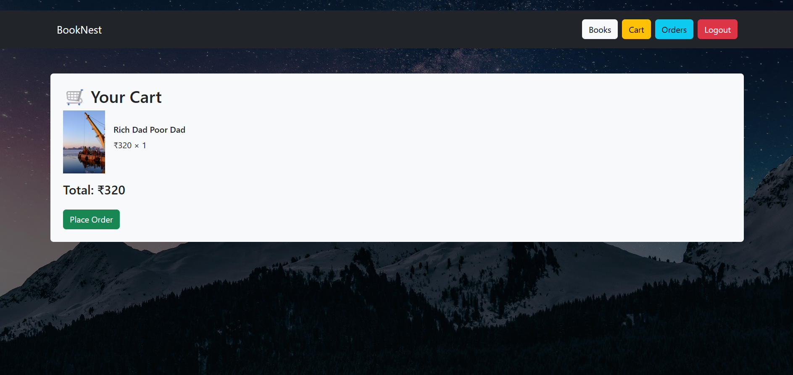
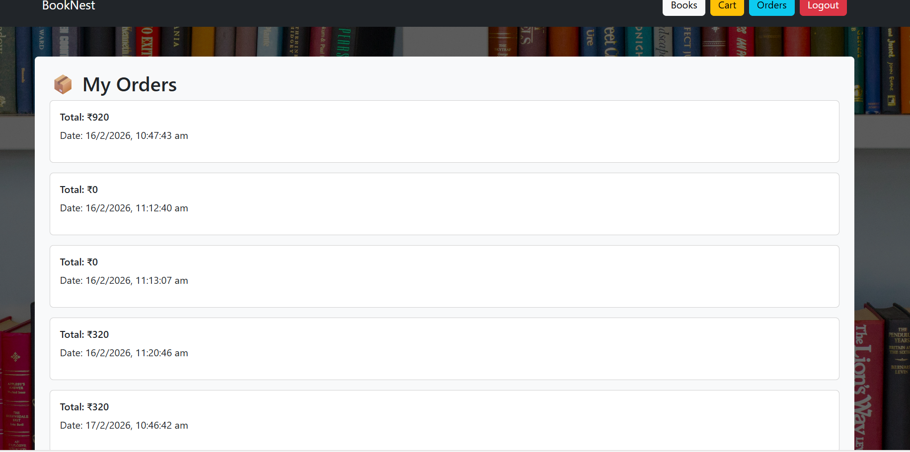

# 📚 BookNest – MERN Stack Online Book Store

BookNest is a full-stack Online Book Store built using the MERN stack (MongoDB, Express.js, React.js, Node.js).  
Users can register, login, browse books, add to cart, and place orders with a beautiful animated UI.

---


## 🚀 Features

🎥 Demo Video : https://drive.google.com/file/d/11Keyg1mScVl3XNe7mr8SzXEGlfJz96od/view?usp=sharing
🚀 Live Demo : https://book-nest-six-topaz.vercel.app/ Click the link
---

## 📸 Demo Screenshots

### 🏠 Home Page


---

### 📝 Register Page


---

### 🔐 Login Page


---

### 📚 Books Page


---

### 🛒 Cart Page


---

### 📦 Orders Page


---


### 🔐 Authentication
- User Registration
- User Login with JWT
- Secure Password Hashing using bcrypt
- Token-based authentication

### 📚 Books
- 100 Real Book Titles
- Different Book Cover Images
- Search functionality
- Animated UI
- Background styling for each page

### 🛒 Cart
- Add to Cart
- Quantity management
- Total price calculation
- LocalStorage based cart

### 📦 Orders
- Place Order
- View Order History
- Order Date & Total Price

### 🎨 UI & Animations
- Animated Navbar
- Page Fade Animations (Framer Motion)
- Background images on all pages
- Responsive Design
- Professional Layout

---

## 🛠️ Tech Stack

### Frontend
- React.js (Vite)
- Axios
- React Router DOM
- Bootstrap
- Framer Motion (Animations)

### Backend
- Node.js
- Express.js
- MongoDB
- Mongoose
- JWT Authentication
- bcryptjs
- CORS

---

## 📂 Project Structure

```
BookNest/
│
├── backend/
│   ├── models/
│   │   ├── User.js
│   │   ├── Book.js
│   │   └── Order.js
│   │
│   ├── routes/
│   │   ├── userRoutes.js
│   │   ├── bookRoutes.js
│   │   └── orderRoutes.js
│   │
│   ├── server.js
│   ├── package.json
│   └── .env
│
├── frontend/
│   ├── src/
│   │   ├── api/
│   │   │   └── axios.js
│   │   │
│   │   ├── components/
│   │   │   ├── Navbar.jsx
│   │   │   ├── BookCard.jsx
│   │   │   └── PageWrapper.jsx
│   │   │
│   │   ├── pages/
│   │   │   ├── Home.jsx
│   │   │   ├── Login.jsx
│   │   │   ├── Register.jsx
│   │   │   ├── Books.jsx
│   │   │   ├── Cart.jsx
│   │   │   └── Orders.jsx
│   │   │
│   │   ├── App.jsx
│   │   └── main.jsx
│   │
│   ├── package.json
│   └── vite.config.js
│
├── screenshots/
│   ├── home.png
│   ├── login.png
│   ├── register.png
│   ├── books.png
│   ├── cart.png
│   └── orders.png
│
└── README.md
```


---

## ⚙️ Installation Guide

### 1️⃣ Clone the Repository

```bash
git clone https://github.com/vamsi746/BookNest.git
cd booknest

2️⃣ Setup Backend
cd backend
npm install


Create a .env file inside backend:

MONGO_URI=your_mongodb_connection_string
JWT_SECRET=your_secret_key


Start backend:

npm run dev


Backend runs at:

http://localhost:5000

3️⃣ Setup Frontend
cd frontend
npm install
npm run dev


Frontend runs at:

http://localhost:5173

🌱 Seed 100 Books

Open in browser:

http://localhost:5000/api/books/seed


This will insert 100 different books with unique images.

## 🚀 Live Deployment

### 🌐 Frontend (Vercel)
👉 https://book-nest-six-topaz.vercel.app

### ⚙ Backend (Render)
👉 https://booknest-backend-0buw.onrender.com

### 🗄 Database
MongoDB Atlas (Cloud Database)

---

## 🛠 Deployment Architecture

- Frontend deployed on **Vercel**
- Backend API deployed on **Render**
- Database hosted on **MongoDB Atlas**
- CORS configured for secure cross-origin communication


🔐 API Endpoints
Users

POST /api/users/register

POST /api/users/login

Books

GET /api/books

GET /api/books?search=keyword

GET /api/books/seed

Orders

POST /api/orders

GET /api/orders

🎯 Future Improvements

⭐ Rating System

💳 Payment Gateway Integration

🖼 Upload Book Images

📱 Fully Responsive Mobile UI

🛠 Admin Dashboard

🛒 Cart Counter Animation

🌙 Dark Mode

👩‍💻 Author

Developed by Sangaraju Lakshmi Narayana


